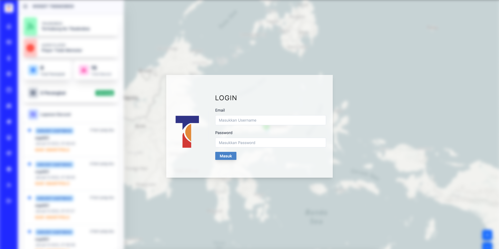
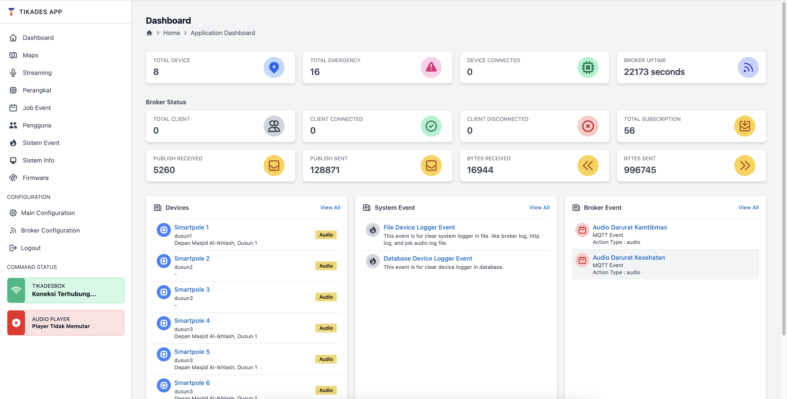
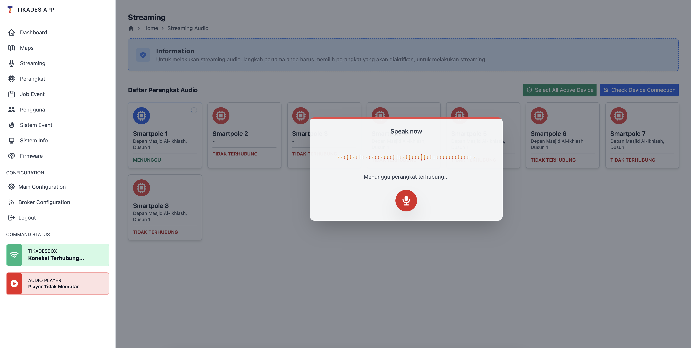
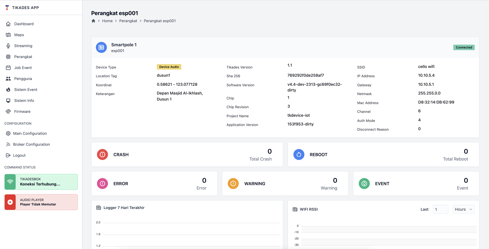

Tikadesbox adalah apilkasi untuk pemantauan laporan darurat masyarakat dan juga aplikasi untuk melaukan streaming audio.
sistem aplikasi tikadesbox terdiri dari perankat ESP sebagai perangkat yang akan mengirimkan laporan darurat, dan juga sebagai perangkat yang akan memurat audio streaming dari aplikasi tikadesbox. 

#### Bagian Yang Dibuat
Pada Aplikasi tikades box saya bertanggunjawab dalam pembuatan firmware ESP, Gateway untuk komunikasi dengan perangkat, dan aplikasi tikadesbox

Untuk Firmware menggunakan C++, Gateway menggunakan GO/Golang, sedangkan untuk tikadesbox menggunakan NextJS

#### Contoh tampilan aplikasi

